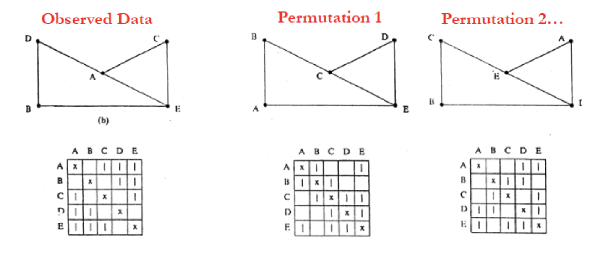

```{r, echo = FALSE, fig.align = 'center', out.width="75%"}
knitr::include_graphics("https://static.wikia.nocookie.net/thelword/images/8/80/LW_S01E09_The_Chart_01.png/revision/latest/scale-to-width-down/1000?cb=2021083014050")
```

# What is a social network?

A social network analysis describes all the individuals in a group AND all the links between them. The photo above shows a social network from the show The L Word. These are all individuals who have romantic and sexual connections to each other.

```{r, echo = FALSE, fig.align = 'center', out.width="50%"}
knitr::include_graphics("https://i.giphy.com/media/fo2db15Hus2pFvxoHq/giphy.webp")
```

## What do social network analyses tell us?

Social network analysis includes the theory, methods, and applications of social networks. <br><br>
In this vignette, you will learn **(1)** how to prepare social network data for analysis and **(2)** how to perform quadratic assignment procedures to assess correlations between social networks (response variables) and factors that may influence networks (predictor variables). <br><br>
A network analysis (as opposed to a non-network analysis) will reveal information about the group as a whole, as opposed to the individual. Looking back at our social network from The L Word, non-network analysis would only look at Shane’s romantic connections alone, but social network analysis can tell us Shane’s romantic connections in relation to Alice’s and Lauren’s, etc. It could also reveal group level characteristics that don’t exist for individuals. We are looking at the patterns of relationships between individuals. An edge is as much a network-object as a node is. 

## Terms to know
- **Nodes**: the individuals in the social network
- **Edges**: the relationships between individuals in a network
```{r, echo=FALSE, out.width="70%"}
knitr::include_graphics("https://memgraph.com/images/blog/introduction-to-node-embedding/memgraph-tutorial-graph-sketch.png")
```

- **Directionality**: some social networks will have a relationship that goes in one direction (e.g., Bonobo A grooms Bonobo B. Other relationships won’t have directionality, such as friendship). *Directionality is relevant for understanding transactional or rank-based relationships.*

- **Edge weight**: the strength of the relationship between individuals, which may differ between individuals within social networks (e.g., if A gives B money, we might be interested the amount they gave. This value is the edge’s weight)
```{r, echo=FALSE, fig.align = 'center', out.width="70%"}
knitr::include_graphics("https://assets-global.website-files.com/5d0dc87aac109e1ffdbe379c/60e19743a601cb5dff42ce85_jd.png")
```

By the end of this module, you should be able to answer the following questions about social networks in R: <br>
1) *How are individuals connected in a group?* <br>
2) *How can we test the extent to which specific factors influence whether individuals in a group are connected?* <br>
3) *How do networks change over time?* 

To accomplish this, we will use social network datasets from nonhuman primates! 

# Installing packages
Here are the packages we'll be using:
```{r packages, message=FALSE}
library(statnet)
library(igraph)
library(intergraph)
```

{igraph} and {statnet} are two of the most commonly used packages for social network analyses. Both include built-in functions that can plot networks and answer almost every beginner-level question about a given network. However, there may be some functions that are present in one package but not the other (or just work better). So, {intergraph} is another useful package that helps users transition between {igraph} and {statnet}. 

# Understanding the structure of social network data

## Loading data
Let's start by loading our data. We'll start with a dataset about bonobos and their grooming partners and GG rubbing partners. 
```{r load in, message = FALSE}
library(curl)
f <- curl("https://raw.githubusercontent.com/nmerullo/AN588_BonoboSpitChain/main/AnzaEtAl_2021_ggr_weighted.csv")
bonobo_ggr_edgelist <- read.csv(f, header = TRUE, sep = ",")
head(bonobo_ggr_edgelist) # data about bonobos' GG rubbing interactions

q <- curl("https://raw.githubusercontent.com/nmerullo/AN588_BonoboSpitChain/main/AnzaEtAl_2021_grooming_weighted.csv")
bonobo_groom_edgelist <- read.csv(q, header = TRUE, sep = ",")
head(bonobo_groom_edgelist) # data about bonobos' grooming interactions
```

## Setting up social network data
How we set-up and manage the social network data can impact the ease with which we navigate our social network analysis. Based on how many individuals there are, whether we know any of their properties (age, sex, etc), and information about the edges themselves (directionality, edge-weights, etc), we can store and input data either as a matrix or an edgelist. 

### Adjacency matrix
A matrix used for social network analysis is called a **sociomatrix** or an **adjacency matrix**. They are square matrices. For directed networks, rows indicate the starting node, and columns indicate the receiving node. Undirected networks are symmetric matrices around the diagonal. For un-weighted networks, the cells contain a 1, for the presence of an edge and a 0 for the absence of an edge between individuals. For weighted networks, the cells can contain the edge-weights instead of 1s and 0s.

### Edge list
Alternatively, we can also represent network data as a columned list, called an **edge list**. Each row of the list represents one edge (one relationship between individuals). In directed data, the first column names the sender of the edge and the second column names the receiver. In undirected data, it does not matter which node is listed first. For weighted data, a third column contains a numeric value for each tie.

**Is our bonobo dataset structured as an edge list or adjacency matrix?**

### Node-Level Variables

To include variables that describe your nodes (age, rank, sex, etc), it is good practice to load in a separate file. This data frame must include one column of the node IDs using the exact same IDs used in the adjacency matrix or edge list. All other variables should then be included in additional columns.
```{r bonobo attributes}
j <- curl("https://raw.githubusercontent.com/nmerullo/AN588_BonoboSpitChain/main/AnzaEtAl_2021_attributes.csv")
bonobo_attribute <- read.csv(j, header = TRUE, sep = ",")
head(bonobo_attribute)
```

Now we can create the network objects and add node attributes to the objects. Note that adding note attributes to objects involves '%v%', which resembles a pipe. This functions similarly to a $ operator and allows us to add rank variables to a dataset.
```{r bonobo network objects}
bonobo_ggr_net <- as.network.data.frame(bonobo_ggr_edgelist) # creates GG rubbing network 
bonobo_groom_net<-as.network.data.frame(bonobo_groom_edgelist) # creates grooming network

bonobo_ggr_net %v% "rank" <- bonobo_attribute$rank #adds rank variable to GG rubbing network
bonobo_ggr_net %v% "age" <- bonobo_attribute$age #adds age variable to GG rubbing network
bonobo_groom_net %v% "rank" <- bonobo_attribute$rank #adds rank variable to grooming network
bonobo_groom_net %v% "age" <- bonobo_attribute$age #adds age variable to grooming network
```

## Visualizing social network data
 
We can visualize social networks by creating network objects with {statnet}. Note the arrows indicating directionality!
```{r visuzalize}
par(mfrow = c(1, 2))
plot(bonobo_ggr_net, label = "vertex.names", main="GG rubbing")
box(col = "black")
plot(bonobo_groom_net, label = "vertex.names", main="Grooming")
box(col = "black")
```

# Quadratic Assignment Procedure (QAP)
When analyzing social network data, we want to know to what degree our variables impact the formation of a particular network organization. Our **independent variables** or predictor variables are node level variables (e.g. age) or similarity between node level variables (e.g. whether pairs belong to the same age category). Our **dependent variable** is the organization of edges in the network. 

We cannot use standard OLS regressions to analyze pair characteristics and the presence of edges between pairs because it violates the assumption that observations are independent. For example, observations A-B, A-C, and A-D are not independent because they all involve individual A. Or if one bonobo is GG rubbing with 5 other bonobos, those 5 other bonobos may also be GG rubbing with each other. 
Quadratic assignment procedure (QAP) addresses this issue of non-independence.

QAP is a resampling-based method that controls for non-independence in network structure via random permutations. These permutations use different arrangements of the rows and columns in the adjacency matrix. Thus, the network structure is maintained but the arrangement of individuals in the structure is randomized. This represents the null hypothesis because it should eliminate any potential correlations between ties and independent values.
```{r qap permutation figure, echo = FALSE}

```

There are 3 types of QAP regressions we can run with {statnet}: correlation regressions, linear regressions, and multiple regressions. We will describe and demonstrate each regression using the bonobo data.

## 1. Correlation
Correlation QAPs simply test whether two social networks are correlated. For example, using our bonobo datasets, we can ask: 
**Do bonobos who groom each other correlate with bonobos who GG rub with one another?**

We can start by using the gcor() function to get a correlation coefficient between the two networks.
```{r correlation qap bonobo1}
gcor(bonobo_ggr_net, bonobo_groom_net)
```

These networks don't seem very correlated but let's test for significance anyways.
```{r correlation qap bonobo2}
qap_cor <- qaptest(list(bonobo_ggr_net, bonobo_groom_net), # include both network objects in a list
                gcor, # the function you're using is correlation between networks (gcor) 
                g1=1, # use first graph in the list
                g2=2, # use second graph in the list
                reps = 1000) # number of permutations to run
summary(qap_cor)
```
[DESCRIBE/INTERPRET OUTPUT]

Should we plot these and explain them? Is that helpful at all? -sam

## 2. Multiple regression (weighted)
Multiple regression QAPs test the extent to which predictor variables are affecting edge weights. <br>
For example, if our predictor variable is rank, we can ask: **Are high-ranking or low-ranking individuals more tied through GG rubbing?** In other words, we are asking: how many times are you likely to have more edges for each unit increase in rank?

Predictor variables must be matrices in order to be used in the QAP functions. We can look at whether rank affects the weight of ties sent or received (or both, but they must be added to the model separately).

First, we must create a matrix that shows the rank of senders. Note that senders are represented by ROWS in the matrices.
```{r matrix rank sender bonobo}
nodes <- 7 # number of nodes in the data set
rank <- bonobo_ggr_net %v% "rank" # a vector of the node-level variable we are interested in

rank_sending <- matrix(data = NA, nrow = nodes, ncol = nodes) # create empty matrix to be filled for senders

for (i in 1:nodes){ # for 1 through the number of nodes in the data set
rank_sending[i,] <- rep(rank[i], nodes)} # the age of each actor is repeated over entire ROW of matrix
rank_sending
```

Next, we must create a matrix that shows the rank of receivers. Note that receivers are represented by COLUMNS in the matrices.
```{r matrix rank receiver bonobo}
rank_receiving <- matrix(data = NA, nrow = nodes, ncol = nodes) # empty matrix for receivers

for (i in 1:nodes){ # for 1 through the number of nodes in the data set
rank_receiving[,i] <- rep(rank[i], nodes)} # the age of each actor is repeated over entire COLUMN of matrix
rank_receiving
```

Now we can run our multiple regression! First we are asking:
**Does rank affect how many times bonobos G-G rubbed others (the weight of the edges they sent)?**
```{r multiple regression qap bonobo 1}
mrqap <- netlm(bonobo_ggr_net, # response variable is a network object with a weighted adjacency matrix
                list(rank_sending)) # list of predictor variables as network or matrix objects
summary(mrqap)
```
[DESCRIBE/INTERPRET OUTPUT]

**Does rank affect how many times bonobos received G-G rubbing from others (the weight of the edges they receive)?**
```{r multiple regression qap bonobo 2}
mrqap <- netlm(bonobo_ggr_net, # response variable is a network object with a weighted adjacency matrix
                list(rank_receiving)) # list of predictor variables as network or matrix objects
summary(mrqap)
```
[DESCRIBE/INTERPRET OUTPUT]

We can include multiple predictor variables! We can also use another network as a predictor variable! For example, we can ask:
**Do sender rank and grooming relationships predict the number of times bonobos G-G rubbed in the network?**
```{r multiple regression qap bonobo 3}
mrqap <- netlm(bonobo_ggr_net, # response variable is a network object with a weighted adjacency matrix
                list(rank_receiving, bonobo_groom_net)) # list of all predictor variables as network or matrix objects

summary(mrqap)
```
[DESCRIBE/INTERPRET OUTPUT]

## 3. Linear regression
Linear regression QAPs test the extent to which independent variables are affecting the presence or absence of edges. <br>
Using our bonobo dataset, we can ask: **Does older age make an individual more or less likely to G-G rub with other individuals?** <br>
In this example, our grooming network is the response variable while age is our predictor variable.

Similar to the multiple regression, we must first create a matrix that shows the rank of senders and receivers. As a reminder, senders are represented by ROWS while receivers are represented by COLUMNS in matrices 
```{r matrix age bonobo}
nodes <- 7 # number of nodes in the data set
age <- bonobo_ggr_net %v% "rank" # a vector of the node-level variable we're interested in

age_sending <- matrix(data = NA, nrow = nodes, ncol = nodes) #create empty matrix to be filled
age_receiving <- matrix(data = NA, nrow = nodes, ncol = nodes)

for (i in 1:nodes){ # for 1 through the number of nodes in the data set
age_sending[i,] <- rep(age[i], nodes)} # The age of each actor is repeated over entire ROW of matrix
age_sending

for (i in 1:nodes){ 
age_receiving[,i] <- rep(age[i], nodes)} 
age_receiving
```

Now we can run our linear regression! 
```{r linear qap bonobo}
lrqap <- netlogit(bonobo_ggr_net, # response variable is a network object with an unweighted adjacency matrix
                  list(age_receiving, age_sending)) # list of all predictor variables as network or matrix objects
summary(lrqap)
```
In the output above, x1 represents the first variable in the model (age_receiving), and x2 represents the second variable in the model (age_sending). [DESCRIBE/INTERPRET OUTPUT]

# Spider Monkey Social Networks
[Something here about why we're doing this again with spider monkey data, maybe describe spider monkeys as a species a little]

```{r, echo = FALSE, fig.align = 'center', out.width="75%"}
knitr::include_graphics("https://www.theanimalreader.com/wp-content/uploads/2023/08/spider-monkeys.jpg")
```

First, we must load our data.
```{r spmonkey}
spmonkey_dat <- curl("https://raw.githubusercontent.com/nmerullo/AN588_BonoboSpitChain/main/spidermonkey_beh_edgelist.csv")
spmonkey_el <- read.csv(spmonkey_dat)
head(spmonkey_el)
unique(spmonkey_el$Beh)
```
We see here that spider monkeys are engaging in four unique social behaviors in this dataset: in contact, mating, playing, and grooming. This means that we can construct four separate social networks. Additionally, the packages that we use can only read edge lists that are in the form of a 2-column format. So, let's clean this data up a bit more. 

First, we are starting with the mating network.
```{r spmoney_mating1}
mating_spmonkey <- spmonkey_el[spmonkey_el$Beh == "mating",] #making a separate data frame for mating
mating_spmonkey <- mating_spmonkey[,-c(2,4)] #removing unnecessary data, we'll add back this "Mins" data as edge attributes later 
sp_mating_net <- as.network(mating_spmonkey, matrix.type = "edgelist", directed = TRUE)
plot(sp_mating_net, label = "vertex.names", main="Spider Monkey Mating Network")
```

Next, let's add network and edge attributes to the network.
```{r spmoney_mating2}
sp_attr <- curl("https://raw.githubusercontent.com/nmerullo/AN588_BonoboSpitChain/main/spidermonkey_attributes.csv")
sp_attr <- read.csv(sp_attr)
head(sp_attr)
sp_attr$age[sp_attr$age == "infant"] <- 1
sp_attr$age[sp_attr$age == "juvenile"] <- 2
sp_attr$age[sp_attr$age == "adult"] <- 3
sp_attr$age <- as.numeric(sp_attr$age)
class(sp_attr$age)
sp_attr$sex[sp_attr$sex == "female"] <- 0
sp_attr$sex[sp_attr$sex == "male"] <- 1
sp_attr$sex <- as.numeric(sp_attr$sex)
class(sp_attr$sex)

sp_mating_net %v% "sex" <- sp_attr$sex #adds sex as node attribute
sp_mating_net %v% "age" <- sp_attr$age #adds age as node attribute
sp_mating_net %v% "repr" <- sp_attr$Repr_status #adds reproductive status as a node attribute
```

We can also add the "Mins" from the initial spider monkey edge list as edge weights.
```{r spmoney_mating3}
sp_mating_net %e% "time" <- spmonkey_el[spmonkey_el$Beh == "mating",]$Mins 
```

This process can be repeated for grooming, play and contact networks.
```{r sp_play}
play_spmonkey <- spmonkey_el[spmonkey_el$Beh == "play",][,-c(2,4)] #making a separate data frame for play behavior
sp_play_net_unweighted <- as.network(play_spmonkey, matrix.type = "edgelist", directed = TRUE, weighted=FALSE)
plot(sp_play_net_unweighted, label = "vertex.names", main="Spider Monkey Play Network")

# Adding network and edge attributes to network
sp_play_net_unweighted %v% "sex" <- sp_attr$sex #adds sex as node attribute
sp_play_net_unweighted %v% "age" <- sp_attr$age #adds age as node attribute
sp_play_net_unweighted %v% "repr" <- sp_attr$Repr_status #adds reproductive status as node attribute
```

```{r sp_groom}
groom_spmonkey <- spmonkey_el[spmonkey_el$Beh == "groom",][,-c(2,4)] #making a separate data frame for grooming behavior
sp_groom_net <- as.network(groom_spmonkey, matrix.type = "edgelist", directed = TRUE, loops = TRUE)
plot(sp_groom_net, label = "vertex.names", main="Spider Monkey Grooming Network")

# Adding network and edge attributes to the network
sp_groom_net %v% "sex" <- sp_attr$sex #adds sex as node attribute
sp_groom_net %v% "age" <- sp_attr$age #adds age as node attribute
sp_groom_net %v% "repr" <- sp_attr$Repr_status #adds reproductive status as a node attribute

# Let's add the "Mins" from the initial spmonkey edgelist as edge weights
sp_groom_net %e% "time" <- spmonkey_el[spmonkey_el$Beh == "groom",]$Mins 
```

```{r sp_contact}
contact_spmonkey <- spmonkey_el[spmonkey_el$Beh == "In contact",][,-c(2,4)] #making a separate data frame for contact
sp_contact_net <- as.network(contact_spmonkey, matrix.type = "edgelist", directed = TRUE, loops = TRUE)
plot(sp_contact_net, label = "vertex.names", main="Spider Monkey Contact Network")

# Adding network and edge attributes to the network
sp_contact_net %v% "sex" <- sp_attr$sex #adds sex as node attribute
sp_contact_net %v% "age" <- sp_attr$age #adds age as node attribute
sp_contact_net %v% "repr" <- sp_attr$Repr_status #adds reproductive status as a node attribute

# Let's add the "Mins" from the initial spmonkey edgelist as edge weights
sp_contact_net %e% "time" <- spmonkey_el[spmonkey_el$Beh == "In contact",]$Mins 
```

Now that we have loaded, cleaned, and visualized our spider monkey dataset, we can analyze it via QAP regressions! 

```{r, echo = FALSE, out.width="75%"}
knitr::include_graphics("https://media.tenor.com/OvqVvPSkfEcAAAAd/you-better-hold-on-tight-spider-monkey-edward-cullen.gif")
```

## QAPs for Spider Monkey Data

### Correlation
**Does grooming frequency correlate with contact frequency in spider monkeys?**
```{r spider monkey correlation qap}
# get the correlation value
gcor(sp_groom_net, sp_contact_net)

# is it significant?
qap_cor <- qaptest(list(sp_groom_net, sp_contact_net), # include both network objects in a list
                gcor, # the function you're using is correlation between networks (gcor) 
                g1=1, # use first graph in the list
                g2=2, # use second graph in the list
                reps = 1000) # number of permutations to run
summary(qap_cor)
```

### Multiple regression (weighted)
Create a matrix that shows the rank of senders.
NOTE: Senders are represented by ROWS in the matrices
```{r}
nodes <- 17 # the number of nodes in the data set
age <- sp_groom_net %v% "age" # a vector of the node-level variable we are interested in

age_sending <- matrix(data = NA, nrow = nodes, ncol = nodes) #create an empty matrix to be filled

for (i in 1:nodes){ # for 1 through the number of nodes in the data set
age_sending[i,] <- rep(age[i], nodes)} # The age of each actor is repeated over entire ROW of matrix
age_sending
```
Create a matrix that shows the rank of receivers
NOTE: Receivers are represented by COLUMNS in the matrices
```{r}
age_receiving <- matrix(data = NA, nrow = nodes, ncol = nodes)

for (i in 1:nodes){ # for 1 through the number of nodes in the data set
age_receiving[,i] <- rep(age[i], nodes)} # The age of each actor is repeated over entire COLUMN of matrix
age_receiving
```

**Is age category predictive of time spent in grooming behavior within dyads of spider monkeys?**
```{r}
mrqap <- netlm(sp_groom_net, # response variable is a network object with a weighted adjacency matrix
                list(age_sending)) # list of all predictor variables as network objects or matrix objects

summary(mrqap)
```

## Linear regression
**Does reproductive status predict mating behavior (number of ties in mating social network)?**
```{r}
nodes <- 16 # the number of nodes in the data set
sex <- sp_play_net_unweighted %v% "sex" # a vector of the node-level variable we are interested in

sex_sending <- matrix(data = NA, nrow = nodes, ncol = nodes) #create an empty matrix to be filled

for (i in 1:nodes){ # for 1 through the number of nodes in the data set
sex_sending[i,] <- rep(sex[i], nodes)} # age of each actor is repeated over entire ROW of matrix
sex_sending
```

Create a matrix that shows the rank of receivers
NOTE: Receivers are represented by COLUMNS in the matrices
```{r}
sex_receiving <- matrix(data = NA, nrow = nodes, ncol = nodes)

for (i in 1:nodes){ # for 1 through the number of nodes in the data set
sex_receiving[,i] <- rep(sex[i], nodes)} # age of each actor is repeated over entire COLUMN of matrix
sex_receiving
```

```{r}
lrqap <- netlogit(sp_play_net_unweighted, # response variable is a network object with an unweighted adjacency matrix
                   list(sex_receiving, sex_sending)) # list of predictor variables as network or matrix objects
summary(lrqap)
```

# References 
[...]
