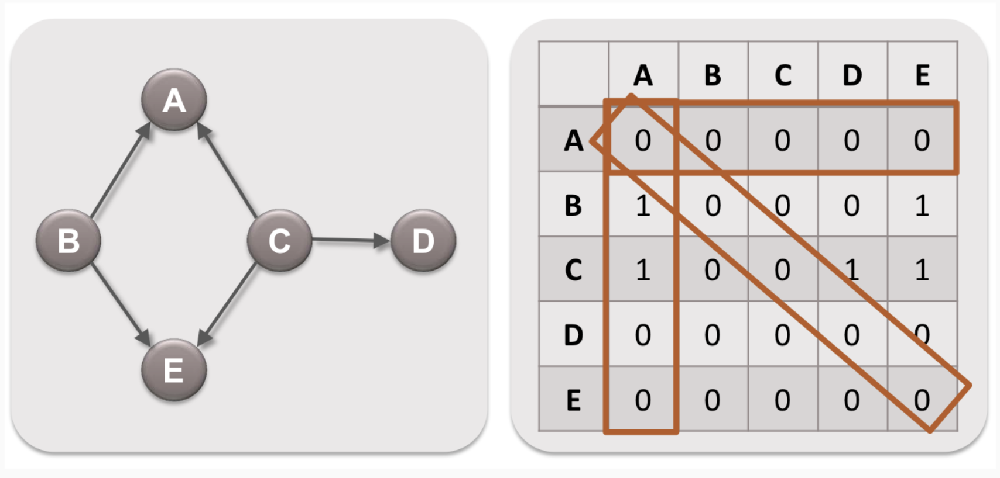
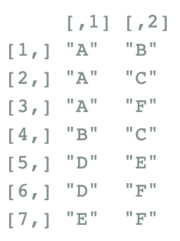

```{r thechart, echo = FALSE, fig.align = 'center', out.width="75%"}
knitr::include_graphics("https://static.wikia.nocookie.net/thelword/images/8/80/LW_S01E09_The_Chart_01.png/revision/latest/scale-to-width-down/1000?cb=2021083014050")
```

# What is a social network?

A social network analysis describes all the individuals in a group AND all the links between them. The photo above shows a social network from the show The L Word. These are all individuals who have romantic and sexual connections to each other.

```{r thesocialnetwork, echo = FALSE, fig.align = 'center', out.width="50%"}
knitr::include_graphics("https://i.giphy.com/media/fo2db15Hus2pFvxoHq/giphy.webp")
```

## What do social network analyses tell us?

Social network analysis includes the theory, methods, and applications of social networks. <br><br>
In this vignette, you will learn **(1)** how to prepare social network data for analysis and **(2)** how to perform quadratic assignment procedures to assess correlations between social networks (response variables) and factors that may influence networks (predictor variables). <br><br>
A network analysis (as opposed to a non-network analysis) will reveal information about the group as a whole, as opposed to the individual. Looking back at our social network from The L Word, non-network analysis would only look at Shane’s romantic connections **independently**, but social network analysis can tell us Shane’s romantic connections in relation to Alice’s and Lauren’s, etc (**not independent**). It could also reveal group level characteristics that don’t exist for individuals. We are looking at the patterns of relationships between individuals. An edge is as much a network-object as a node is. 

## Terms to know
- **Nodes**: the individuals in the social network
- **Edges**: the relationships between individuals in a network
```{r nodesandedges, echo=FALSE, out.width="70%"}
knitr::include_graphics("https://memgraph.com/images/blog/introduction-to-node-embedding/memgraph-tutorial-graph-sketch.png")
```

- **Directionality**: some social networks will have a relationship that goes in one direction (e.g., Bonobo A grooms Bonobo B. Other relationships won’t have directionality, such as friendship). *Directionality is relevant for understanding transactional or rank-based relationships.*
- **Edge weight**: the strength of the relationship between individuals, which may differ between individuals within social networks (e.g., if A gives B money, we might be interested the amount they gave. This value is the edge’s weight)
```{r edgeweight, echo=FALSE, fig.align = 'center', out.width="70%"}
knitr::include_graphics("https://assets-global.website-files.com/5d0dc87aac109e1ffdbe379c/60e19743a601cb5dff42ce85_jd.png")
```

By the end of this module, you should be able to answer the following questions about social networks in R: <br>
1) *How are individuals connected in a group?* <br>
2) *How can we test the extent to which specific attributes influence whether individuals in a group are connected?* <br>
3) *How do networks change over time?* 

To accomplish this, we will use social network datasets from nonhuman primates! We will start with a dataset from bonobos. Bonobos are one of our closest living relatives and live in multi-male/multi-female social groups. Female bonobos are highly cohesive and have strong affiliative bonds. These bonds are maintained through high levels of sociosexual behavior, the most common being genito-genital (GG) rubbing. But similar to other primates, bonobos will also groom each other.

```{r bonobos, echo = FALSE, fig.align = 'center', out.width="75%"}
knitr::include_graphics("https://news.asu.edu/sites/default/files/bonobo_kokolopori_martin_surbeck.jpg")
```

# Installing packages
Here are the packages we will be using:
```{r packages, message=FALSE}
library(statnet)
library(igraph)
library(intergraph)
```

{igraph} and {statnet} are two of the most commonly used packages for social network analyses. Both include built-in functions that can plot networks and answer almost every beginner-level question about a given network. However, there may be some functions that are present in one package but not the other (or just work better). So, {intergraph} is another useful package that helps users transition between {igraph} and {statnet}. 

# Understanding the structure of social network data

## Loading data
Let's start by loading our data from bonobos. There are two datasets from the same bonobo population. One describes their GG rubbing network and the other describes their grooming networks.
```{r load in, message = FALSE}
library(curl)
f <- curl("https://raw.githubusercontent.com/nmerullo/AN588_BonoboSpitChain/main/AnzaEtAl_2021_ggr_weighted.csv")
bonobo_ggr_edgelist <- read.csv(f, header = TRUE, sep = ",")
head(bonobo_ggr_edgelist) # data about bonobos' GG rubbing interactions

q <- curl("https://raw.githubusercontent.com/nmerullo/AN588_BonoboSpitChain/main/AnzaEtAl_2021_grooming_weighted.csv")
bonobo_groom_edgelist <- read.csv(q, header = TRUE, sep = ",")
head(bonobo_groom_edgelist) # data about bonobos' grooming interactions
```
**What are we looking at in these data sets? Who are the actors (also known as senders) vs the receivers? In the first 6 rows we are looking at for each data set, who has the most weighted relationship? What does this mean?**

## Setting up social network data
How we set-up and manage the social network data can impact the ease with which we navigate our social network analysis. Based on how many individuals there are, whether we know any of their attributes (age, sex, etc), and information about the edges themselves (directionality, edge-weights, etc), we can store and input data either as a matrix or an edgelist. 

### Adjacency matrix
A matrix used for social network analysis is called a **sociomatrix** or an **adjacency matrix**. They are square matrices. For directed networks, rows indicate the starting node, and columns indicate the receiving node. Undirected networks are symmetric matrices around the diagonal. For un-weighted networks, the cells contain a 1, for the presence of an edge and a 0 for the absence of an edge between individuals. For weighted networks, the cells can contain the edge-weights instead of 1s and 0s.
```{r adjacency matrix fig, echo = FALSE}

```


### Edge list
Alternatively, we can also represent network data as a columned list, called an **edge list**. Each row of the list represents one edge (one relationship between individuals). In directed data, the first column names the sender of the edge and the second column names the receiver. In undirected data, it does not matter which node is listed first. For weighted data, a third column contains a numeric value for each tie.

```{r edge list fig, echo = FALSE, out.width="25%"}

```

An edge list is usually easier for a person to interpret. However, it is important to be familiar with adjacency matrices as they are the format used to conduct mathematical operations in various social network analyses.

**Is our bonobo dataset structured as an edge list or adjacency matrix?**

### Node-Level Variables

To include variables that describe your nodes (age, rank, sex, etc), it is good practice to load in a separate file. This data frame must include one column of the node IDs using the exact same IDs used in the adjacency matrix or edge list. All other variables should then be included in additional columns.
```{r bonobo attributes}
j <- curl("https://raw.githubusercontent.com/nmerullo/AN588_BonoboSpitChain/main/AnzaEtAl_2021_attributes.csv")
bonobo_attribute <- read.csv(j, header = TRUE, sep = ",")
bonobo_attribute
```
**Who is the highest ranking bonobo? Who is the lowest? Who is the oldest? Who is the youngest?**

Now we can create the network objects and add node attributes to the objects. Note that adding node attributes to objects involves '%v%', which resembles a pipe. This functions similarly to a $ operator and allows us to add rank variables to a dataset.
```{r bonobo network objects}
bonobo_ggr_net <- as.network.data.frame(bonobo_ggr_edgelist) # turns GG rubbing edge list into a GG rubbing network
bonobo_groom_net<-as.network.data.frame(bonobo_groom_edgelist) # turns grooming edge list into a grooming network

bonobo_ggr_net %v% "rank" <- bonobo_attribute$rank #adds rank variable to GG rubbing network as a vertex attribute
bonobo_ggr_net %v% "age" <- bonobo_attribute$age #adds age variable to GG rubbing network as a vertex attribute
bonobo_groom_net %v% "rank" <- bonobo_attribute$rank #adds rank variable to grooming network as a vertex attribute
bonobo_groom_net %v% "age" <- bonobo_attribute$age #adds age variable to grooming network as a vertex attribute
```

Now that everything it set up, we can use summary() to look at our networks. For example, let's take a look at the bonobo grooming network. 
```{r bonobo network objects2}
summary(bonobo_ggr_net)
```

**Using what we have learned so far, how can we interpret the output of this summary?**

## Visualizing social network data
 
We can visualize social networks by creating network objects with {statnet}. Note the arrows indicating directionality!
```{r visualize}
par(mfrow = c(1, 2))
plot(bonobo_ggr_net, label = "vertex.names", main="GG rubbing") 

# this plot looks great, but can we make it more informative? Let's see if we can add the edge weights and color the nodes by rank: 

plot(bonobo_ggr_net, vertex.col = "rank", label = "vertex.names", main="GG rubbing", vertex.cex = 2, edge.label = "GGR.Weight", edge.label.cex = 0.6)

# this will enable us to have an intuitive understanding of how much individuals interact with one another based on their rankings. 


bonobo_ggr_net$rank
box(col = "black")
ggplot(bonobo_groom_net, label = "vertex.names", main="Grooming")
box(col = "black")

plot(bonobo_groom_net, vertex.col = "rank", label = "vertex.names", main="Grooming", vertex.cex = 2, edge.label = "weight", edge.label.cex = 0.6)
```

**How would you describe these two plots? What stands out? What's different?**

# Quadratic Assignment Procedure (QAP)
When analyzing social network data, we want to know to what degree our variables impact the formation of a particular network organization. Our **independent variables** or predictor variables are node level variables (e.g. age) or similarity between node level variables (e.g. whether pairs belong to the same age category). Our **dependent variable** is the organization of edges in the network. 

We cannot use standard OLS regressions to analyze pair characteristics and the presence of edges between pairs because it violates the assumption that observations are independent. For example, observations A-B, A-C, and A-D are not independent because they all involve individual A. Or if one bonobo is GG rubbing with 5 other bonobos, those 5 other bonobos may also be GG rubbing with each other. 
Quadratic assignment procedure (QAP) addresses this issue of non-independence.

QAP is a resampling-based method that controls for non-independence in network structure via random permutations. These permutations use different arrangements of the rows and columns in the adjacency matrix. Thus, the network structure is maintained but the arrangement of individuals in the structure is randomized. This represents the null hypothesis because it should eliminate any potential correlations between ties and independent values.
```{r qap permutation figure, echo = FALSE}

```

**What kinds of questions would you ask with our bonobo data?**

There are 3 types of QAP regressions we can run with {statnet}: correlation regressions, multiple/linear regressions, and logistic regressions. We will describe and demonstrate each regression using the bonobo data. We'll also do the same with a more complex dataset from spider monkeys! 

## 1. Correlation
Correlation QAPs simply test whether two social networks are correlated. For example, using our bonobo datasets, we can ask: 
**Do bonobos who groom each other correlate with bonobos who GG rub with one another?**

**What is our null hypothesis and alternative hypothesis in this question?**

We can start by using the gcor() function to get a correlation coefficient between the two networks.
```{r correlation qap bonobo1}
gcor(bonobo_ggr_net, bonobo_groom_net)
```

**What does this correlation coefficient signify?**

These networks don't seem very correlated but let's test for significance anyways. The qaptest() function uses Monte Carlo simulations of likelihood quantiles to test arbitrary graph-level statistics against a QAP null hypothesis.
```{r correlation qap bonobo2}
qap_cor <- qaptest(list(bonobo_ggr_net, bonobo_groom_net), # include both network objects in a list
                gcor, # the function you're using is correlation between networks (gcor) 
                g1=1, # use first graph in the list (in this case the GG rubbing network)
                g2=2, # use second graph in the list (in this case the groom network)
                reps = 1000) # number of permutations to run (1000 is actually the default)
summary(qap_cor)
```
Under "Test Diagnostics", the test value represents the correlation coefficient between grooming and GG rubbing networks. This is interpreted at the level of the dyad, pairs who groom each other are likely not correlated to pairs who GG rub with one another. We previously calculated this using the gcor() function. A positive value indicates that networks positively correlate. In other words, one network has ties where the other also does. A negative value indicates that networks negatively correlate. In other words, one network has ties whether the other does not.

Under "Estimated p-values", we find statistics that tell us about how this observed correlation compares to what the correlation looks like when we randomly permute one of our networks. Note that these are both one-tailed p-values! One tests whether the correlation is higher than expected by random chance (p(f(perm) >= f(d))), and the other tests whether the correlation is lower than expected by random chance (p(f(perm) <= f(d)). We can see that our p-values are greater than 0.05, meaning we have evidence to fail to reject our null hypothesis. There is no significant correlation between grooming and GG rubbing networks.

We can also visualize the "Distribution Summary" using the plot() function.

```{r qap correlation plot}
plot(qap_cor)
```

The dotted line gives us the correlation among the observed networks. The curve shows the distribution of correlations across the permuted networks. The permutations are random, so they are expected to form a normal distribution in which most of the permutations have a correlation of 0. The correlation of our observed networks falls within the typical amount of correlation expected from random networks.

## 2. Linear/Multiple regression
Linear regression QAPs test the extent to which predictor variables are affecting edge weights. Recall that our predictor variables are node attributes. 

For example, if our predictor variable is rank, we can ask: **Does rank influence the edge weight of GG rubbing?** In other words, we are asking: Is a bonobo more likely to have more weighted edges for each unit increase in rank? 

**Before we dive in, what do you predict? Do you think there is be a difference between actors (senders) and receivers? What does it mean to have more edge weight?**

Predictor variables must be matrices in order to be used in the QAP functions. We can look at whether rank affects the weight of ties sent or received (or both, but they must be added to the model separately).

First, we must create a matrix that shows the rank of senders. Note that senders are represented by ROWS in the matrices.

```{r matrix rank sender bonobo}
nodes <- length(bonobo_attribute$actor) # number of nodes in the data set
rank <- bonobo_ggr_net %v% "rank" # a vector of the node-level variable we are interested in

rank_sending <- matrix(data = NA, nrow = nodes, ncol = nodes) # create empty matrix to be filled for senders

for (i in 1:nodes){ # for 1 through the number of nodes in the data set
rank_sending[i,] <- rep(rank[i], nodes)} # the rank of each actor is repeated over entire ROW of matrix
rank_sending
```

Next, we must create a matrix that shows the rank of receivers. Note that receivers are represented by COLUMNS in the matrices.

```{r matrix rank receiver bonobo}
rank_receiving <- matrix(data = NA, nrow = nodes, ncol = nodes) # empty matrix for receivers

for (i in 1:nodes){ # for 1 through the number of nodes in the data set
rank_receiving[,i] <- rep(rank[i], nodes)} # the rank of each receiver is repeated over entire COLUMN of matrix
rank_receiving
```

Now we can run our linear regression! First we are asking:
**Does rank affect how many times bonobos GG rubbed others (the weight of the edges they sent)?**
Our null hypothesis is that rank does not affect how many times bonobos GG rub others (both high and low).

```{r linear regression qap bonobo 1}
lrqap <- netlm(bonobo_ggr_net, # response variable is a network object with a weighted adjacency matrix
                list(rank_sending)) # list of predictor variables as network or matrix objects
summary(lrqap)
```

To interpret this we can imagine the x axis being rank and the y axis being edge weight. For every unit increase in rank, edge weights are going **down** 0.1161796 (the estimate of x1 in the above coefficients). This relationship is slightly significant at 0.032 on the two tailed test. However, if we look at our adjusted r^2 value, our model is only explaining ~4% of the variability. And our F-statistic p value is too high to be significant at 0.111. Taken together, we can say that the rank of sender is not significantly explaining the edge weight of GG rubbing interactions.

Now let's look at the receivers.

**Does rank affect how many times bonobos received GG rubbing from others (the weight of the edges they receive)?**
The null hypothesis is the same as above, that rank of receiver does not affect the number of times they are GG rubbed with.

```{r linear regression qap bonobo 2}
lrqap2 <- netlm(bonobo_ggr_net, # response variable is a network object with a weighted adjacency matrix
                list(rank_receiving)) # list of predictor variables as network or matrix objects
summary(lrqap2)
```
```{r}
plot(lrqap2)
```


Just like with the actors/senders, let's imagine that rank is on the x axis and edge weight is on the y axis. Again, we see a negative slope, though this one is even less steep at -0.07247427. The two tailed test p value for this variable is not significant. This model is explaining almost 0% of the variability, which means this model is really not a good fit for the residuals. We can imagine the points scattered far away from the line. The F-statistic p-value is too high to be significant at 0.3249, which is even higher than the sender p-value. Rank of receiver does not significantly explain the edge weight of GG rubbing interactions. 

So we fail to reject the null hypothesis in this question too. But that begs the question, **if rank is not influencing the edge weight, then is there some other attribute that is?**

What if we included multiple predictor variables? We can add another network as a predictor variable! By doing so, we are conducting a multiple regression QAP. For example, we can now ask:
**Do sender rank and grooming relationships predict the number of times bonobos GG rubbed in the network?**
The null hypothesis is that neither rank of the actor nor grooming relationships affect the number of times bonobos initiate GG rubbing (two tailed test).

```{r multiple regression qap bonobo 3}
mrqap <- netlm(bonobo_ggr_net, # response variable is a network object with a weighted adjacency matrix
                list(rank_sending, bonobo_groom_net)) # list of all predictor variables as network or matrix objects

summary(mrqap)
```

**Are any of the above relationships significant when taken into the model together?**
**Is this model a better fit than the others? How can we tell?**

## 3. Logistic regression
Logistic regression QAPs test the extent to which independent variables are affecting the presence or absence of edges, but not the weight of those edges. If you have a network with binary ties, we can use this regression method to predict ties in the outcome network (response variable) <br>
Using our bonobo dataset, we can ask: **Does older age make an individual more or less likely to G-G rub with other individuals?** <br>
In this example, our GG rubbing network is the response variable while age is our predictor variable.

If you imagine age (as the predictor variable) on the x axis, for every year a bonobo gets older, are they more likely to GG rub with more individuals? Will an older individual have more ties on the social network?

Similar to the multiple regression, we must first create a matrix that shows the rank of senders and receivers. As a reminder, senders are represented by ROWS while receivers are represented by COLUMNS in matrices 

```{r matrix age bonobo}
nodes <- length(bonobo_attribute$actor) # number of nodes in the data set
age <- bonobo_ggr_net %v% "age" # a vector of the node-level variable we're interested in

age_sending <- matrix(data = NA, nrow = nodes, ncol = nodes) #create empty matrix to be filled
age_receiving <- matrix(data = NA, nrow = nodes, ncol = nodes)

for (i in 1:nodes){ # for 1 through the number of nodes in the data set
age_sending[i,] <- rep(age[i], nodes)} # The age of each actor is repeated over entire ROW of matrix
age_sending

for (i in 1:nodes){ 
age_receiving[,i] <- rep(age[i], nodes)} 
age_receiving
```

Now we can run our logistic regression! 

**What is our null hypothesis for this question?**

The netlogit() function performs a logistic regression of the network variable for the response variable (bonobo_ggr_net) on the network variables in the predictor variables (age_receiving and age_sending). The resulting fits and coefficients are tested against the null hypothesis.
```{r logistic qap bonobo}
logqap <- netlogit(bonobo_ggr_net, # response variable is a network object with an unweighted adjacency matrix
                  list(age_receiving, age_sending), # list of all predictor variables as network or matrix objects
                  reps = 1000) # number of draws for quantile estimation, 1000 reps is the default
summary(logqap)
```
As a reminder, we are testing whether age affects the likelihood of giving and receiving GG rubbing. In the output above, x1 represents the first variable in the model (age_receiving), and x2 represents the second variable in the model (age_sending).

Because they hypothesis we were testing was whether there is any relationship between age and sending and receiving ties, we will use the two-tailed p-valued in the column labeled Pr(>=|b|). There are no significant relationships between either predictor variable and the presence of ties in the network. 

For the sake of practicing, we will interpret the slopes anyway. The first column, "Estimate" is the log odds which is difficult to interpret. Think of it as a tendency to form or not form ties. The log odds for age_receiving is -0.03708264, so there is an increasing tendency with age to not receive ties. The second column, Exp(b), gives odds ratios instead, which are easier to understand. The odds ratio gives the likelihood of a tie to form (or not form) under one condition in contrast to another condition. The odds ratio of age_receiving is c. So for each year older a female bonobo is, she is 0.9635965 times as likely to receive any given tie compared to if she was a year younger. More generally, they are less likely to receive GG rubbing as they get older. The same can be said for sending ties as they get older. However, we cannot actually say this, as the relationships are not significant. The Chi-squared goodness of fit test p-value is significant.

A follow up question given these results could be: are older bonobos less likely to participate in GG rubbing as often as younger bonobos? We could answer this with a linear regression QAP.

Our bonobo data was a little anti-climactic. But sometimes, that's the nature of small sample primatology work. To make things a little more exciting, let's run the three QAPs again with some spider monkey data.


# Spider Monkey Social Networks
The spider monkeys in this data set are *Ateles hybridus* or brown spider monkeys. They are a group living primate with fission-fusion dynamics, similar to bonobos. However, spider monkeys are platyrrhines whereas bonobos are apes. The original intent of this data set and what it was published for was to test how parasites moved between individuals depending on different levels of contact. That leaves us with a rich dataset of networks and attributes that we can work with!
```{r, echo = FALSE, fig.align = 'center', out.width="75%"}
knitr::include_graphics("https://www.theanimalreader.com/wp-content/uploads/2023/08/spider-monkeys.jpg")
```

First, we must load our data.
```{r spmonkey}
spmonkey_dat <- curl("https://raw.githubusercontent.com/nmerullo/AN588_BonoboSpitChain/main/spidermonkey_beh_edgelist.csv")
spmonkey_el <- read.csv(spmonkey_dat)
head(spmonkey_el)
unique(spmonkey_el$Beh) #subsetting the column for proximity types
```
We see here that spider monkeys are engaging in four unique social behaviors in this dataset: in contact, mating, playing, and grooming. This means that we can construct four separate social networks. Additionally, the packages that we use can only read edge lists that are in the form of a 2-column format. So, let's clean this data up a bit more. 

First, we are starting with the mating network.
```{r spmoney_mating1}
mating_spmonkey <- spmonkey_el[spmonkey_el$Beh == "mating",] #making a separate data frame for mating
mating_spmonkey <- mating_spmonkey[,-c(2,4)] #removing unnecessary column data, we'll add back this "Mins" data as edge attributes later 
sp_mating_net <- as.network(mating_spmonkey, matrix.type = "edgelist", directed = TRUE)
plot(sp_mating_net, label = "vertex.names", main="Spider Monkey Mating Network")
```

Next, let's add network and edge attributes to the network.
```{r spmoney_mating2}
sp_attr <- curl("https://raw.githubusercontent.com/nmerullo/AN588_BonoboSpitChain/main/spidermonkey_attributes.csv")
sp_attr <- read.csv(sp_attr)
head(sp_attr)
sp_attr$age[sp_attr$age == "infant"] <- 1 #assigning a numeric value to each life history stage
sp_attr$age[sp_attr$age == "juvenile"] <- 2
sp_attr$age[sp_attr$age == "adult"] <- 3
sp_attr$age <- as.numeric(sp_attr$age)
class(sp_attr$age) #confirming the age attribute is coming up as a numeric class
sp_attr$sex[sp_attr$sex == "female"] <- 0 #assigning a numeric value to each sex
sp_attr$sex[sp_attr$sex == "male"] <- 1
sp_attr$sex <- as.numeric(sp_attr$sex)
class(sp_attr$sex) #confirming the sex attribute is coming up as a numeric class
#next we need to assign the node attributes to the mating network
sp_mating_net %v% "sex" <- sp_attr$sex #adds sex as node attribute
sp_mating_net %v% "age" <- sp_attr$age #adds age as node attribute
sp_mating_net %v% "repr" <- sp_attr$Repr_status #adds reproductive status as a node attribute
```

We can also add the "Mins" from the initial spider monkey edge list as edge weights. The %e% operator is like the %v% operator. It subsets a network object to the edge attribute so we can store time (in minutes spent mating) there.

```{r spmoney_mating3}
sp_mating_net %e% "time" <- spmonkey_el[spmonkey_el$Beh == "mating",]$Mins 
summary(sp_mating_net) #can summarize the network like we did for the bonobo GG rubbing network
```

This process can be repeated for grooming, play and contact networks.

```{r sp_play}
play_spmonkey <- spmonkey_el[spmonkey_el$Beh == "play",][,-c(2,4)] #making a separate data frame for play behavior
sp_play_net_unweighted <- as.network(play_spmonkey, matrix.type = "edgelist", directed = TRUE, weighted=FALSE)
plot(sp_play_net_unweighted, label = "vertex.names", main="Spider Monkey Play Network")

# Adding network and edge attributes to network
sp_play_net_unweighted %v% "sex" <- sp_attr$sex #adds sex as node attribute
sp_play_net_unweighted %v% "age" <- sp_attr$age #adds age as node attribute
sp_play_net_unweighted %v% "repr" <- sp_attr$Repr_status #adds reproductive status as node attribute
```

```{r sp_groom}
groom_spmonkey <- spmonkey_el[spmonkey_el$Beh == "groom",][,-c(2,4)] #making a separate data frame for grooming behavior
sp_groom_net <- as.network(groom_spmonkey, matrix.type = "edgelist", directed = TRUE, loops = TRUE)
plot(sp_groom_net, label = "vertex.names", main="Spider Monkey Grooming Network")

# Adding network and edge attributes to the network
sp_groom_net %v% "sex" <- sp_attr$sex #adds sex as node attribute
sp_groom_net %v% "age" <- sp_attr$age #adds age as node attribute
sp_groom_net %v% "repr" <- sp_attr$Repr_status #adds reproductive status as a node attribute

# Let's add the "Mins" from the initial spmonkey edgelist as edge weights
sp_groom_net %e% "time" <- spmonkey_el[spmonkey_el$Beh == "groom",]$Mins 
```

```{r sp_contact}
contact_spmonkey <- spmonkey_el[spmonkey_el$Beh == "In contact",][,-c(2,4)] #making a separate data frame for contact
sp_contact_net <- as.network(contact_spmonkey, matrix.type = "edgelist", directed = TRUE, loops = TRUE)
plot(sp_contact_net, label = "vertex.names", main="Spider Monkey Contact Network")

# Adding network and edge attributes to the network
sp_contact_net %v% "sex" <- sp_attr$sex #adds sex as node attribute
sp_contact_net %v% "age" <- sp_attr$age #adds age as node attribute
sp_contact_net %v% "repr" <- sp_attr$Repr_status #adds reproductive status as a node attribute

# Let's add the "Mins" from the initial spmonkey edgelist as edge weights
sp_contact_net %e% "time" <- spmonkey_el[spmonkey_el$Beh == "In contact",]$Mins 
```

**How was this process different from the bonobo data loading, cleaning, and visualizing process? How do these plots compare to the bonobo data? Do you think we could make any predictions based on just looking at these plots?**

Now that we have loaded, cleaned, and visualized our spider monkey dataset, we can analyze it via QAP regressions! 

```{r twilight fig, echo = FALSE, out.width="75%"}
knitr::include_graphics("https://media.tenor.com/OvqVvPSkfEcAAAAd/you-better-hold-on-tight-spider-monkey-edward-cullen.gif")
```

## QAPs for Spider Monkey Data

**What are some questions you would ask about our spider monkey social networks and which QAP would you use?**

### Correlation

We need to use two networks with the same number of nodes so we chose to ask a question about grooming and contact.

**Does grooming relationships correlate with contact relationships in spider monkeys?**

**What is our null hypothesis? Alternative hypothesis?**

```{r spider monkey correlation qap}
# get the correlation value
gcor(sp_groom_net, sp_contact_net)

# is it significant?
qap_cor <- qaptest(list(sp_groom_net, sp_contact_net), # include both network objects in a list
                gcor, # the function you're using is correlation between networks (gcor) 
                g1=1, # use first graph in the list
                g2=2, # use second graph in the list
                reps = 1000) # number of permutations to run
summary(qap_cor)
plot(qap_cor)
```
**How do you interpret this?**
**Are these highly correlated networks?** 
**Which test (upper or lower tailed) is significant?**

### Linear regression

Recall that in linear regression for social network analysis involves identifying an independent variable (node attributes) to test its effect on the edge weight of the response variable (the social network). For the spider monkeys, we have multiple options for both node attributes and social networks. We chose to look at age and time spent grooming. 

**Is age category predictive of time spent in grooming behavior within dyads of spider monkeys?**

But before we can get into the analysis, we must first make the matrices for senders and receivers of grooming like we did for the bonobos. As a reminder, senders are represented by ROWS in the matrices.

```{r spmonk-lr-matrix1}
nodes <- length(sp_attr$ID) # the number of nodes in the data set
age <- sp_groom_net %v% "age" # a vector of the node-level variable we are interested in

age_sending <- matrix(data = NA, nrow = nodes, ncol = nodes) #create an empty matrix to be filled

for (i in 1:nodes){ # for 1 through the number of nodes in the data set
age_sending[i,] <- rep(age[i], nodes)} # The age of each actor is repeated over entire ROW of matrix
head(age_sending)
```

Receivers are represented by COLUMNS in the matrices

```{r spmonk-lr-matrix2}
age_receiving <- matrix(data = NA, nrow = nodes, ncol = nodes)

for (i in 1:nodes){ # for 1 through the number of nodes in the data set
age_receiving[,i] <- rep(age[i], nodes)} # The age of each actor is repeated over entire COLUMN of matrix
head(age_receiving)
```

**What is the null hypothesis? What is the alternative hypothesis?**

```{r spmonk-lr-qap}
lrqap.sp <- netlm(sp_groom_net, # response variable is a network object with a weighted adjacency matrix
                list(age_sending)) # list of all predictor variables as network objects or matrix objects

summary(lrqap.sp)
```

- **Does age have a positive or negative relationship with amoung ot time spent grooming?**
- **For each unit (in this case life history stage) of age increase, how much more or less likely is a spider monkey to groom?**
- **Is the relationship between age and grooming significant?** 
- **How much variability in the data does this model explain?**
- **Is it a good fit model? Is this is a significant effect? How can you tell?**

### Logistic regression
Recall that for logistic regression we are testing the presence or absence of ties based on the predictor variable (node attribute). Here we chose to look at the effect of sex of individuals on the presence or absence of ties in the play network.

**Does sex predict play behavior (number of ties in play social network)?** In other words, do males or females play more?

Again, we make the matrices for the variables for both sending (rows) and receiving (columns) individuals.

```{r spmonk-logr-matrix1}
nodes <- 16 # the number of nodes in the data set
sex <- sp_play_net_unweighted %v% "sex" # a vector of the node-level variable we are interested in

sex_sending <- matrix(data = NA, nrow = nodes, ncol = nodes) #create an empty matrix to be filled

for (i in 1:nodes){ # for 1 through the number of nodes in the data set
sex_sending[i,] <- rep(sex[i], nodes)} # sex of each actor repeated over entire ROW of matrix
head(sex_sending)
```

```{r spmonk-logr-matrix2}
sex_receiving <- matrix(data = NA, nrow = nodes, ncol = nodes)

for (i in 1:nodes){ # for 1 through the number of nodes in the data set
sex_receiving[,i] <- rep(sex[i], nodes)} # sex of each actor repeated over entire COLUMN of matrix
head(sex_receiving)
```

**What is the null hypothesis? What is the alternative hypothesis?**

```{r spmonk-logr-qap}
lrqap <- netlogit(sp_play_net_unweighted, # response variable is a network object with an unweighted adjacency matrix
                  list(sex_receiving, sex_sending), # list of predictor variables as network or matrix objects
                  reps = 1000) 
summary(lrqap)
```

**Do either sex receiving or sex sending have a significant relationship with amount of edges in the play network?**
**Does this model significantly explain the effect?**

# References 
Anzà, S., Demuru, E., & Palagi, E. (2021). Sex and grooming as exchange commodities in female bonobos’ daily biological market. Scientific reports, 11(1), 19344.

David, H. A. (1987). Ranking from unbalanced paired-comparison data. Biometrika, 74(2), 432–436. https://doi.org/10.1093/biomet/74.2.432

De Vries, H., Stevens, J. M. G., & Vervaecke, H. (2006). Measuring and testing the steepness of dominance hierarchies. Animal Behaviour, 71(3), 585–592. https://doi.org/10.1016/j.anbehav.2005.05.015

Luke, Douglas A. 2015. A User’s Guide to Network Analysis in R. Springer.

Rimbach, R., Bisanzio, D., Galvis, N., Link, A., Di Fiore, A., & Gillespie, T. R. (2015). Brown spider monkeys (Ateles hybridus): A model for differentiating the role of social networks and physical contact on parasite transmission dynamics. Philosophical Transactions of the Royal Society B: Biological Sciences, 370(1669), 20140110. https://doi.org/10.1098/rstb.2014.0110

Wasserman, S., & Faust, K. (1994). Social network analysis: Methods and applications. Cambridge University Press.
